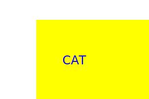

# SVG Logo Maker

## Description
This application was designed to create SVG logos based on user input. Using the Inquirer and File System Module, this application asks users for text to add to the logo, what color the text should be, the type of shape - Triangle, Square, or Circle - and what color the shape should be. Once finished, a file called "logo.svg" is generated, which the user can open to see their logo created.

## SVG Logo Example

## Video Demonstration
[Click here to watch a video demonstration of the live application](https://drive.google.com/file/d/1G5VhEo_LAlgE8SWuH7E1jKwudEsTcCj8/view)
